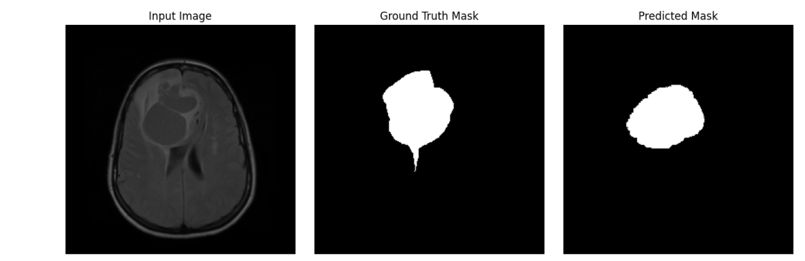

# Brain Tumor Segmentation — U-Net + VGG16 (LGG MRI, Kaggle)

A U-Net segmentation model with a pretrained **VGG16 encoder** (PyTorch), trained on the
**LGG (Lower-Grade Glioma) MRI Segmentation** dataset from Kaggle, to segment tumor
regions in brain MRI slices.

> Implemented in **PyTorch** (`torch` / `torchvision`), trained for 30 epochs with a Dice loss.

---

## Project Structure

```
brain-tumor-segmentation/
├── README.md
├── requirements.txt
├── LICENSE
├── .gitignore
├── notebooks/
│   └── part1-30-epoch.ipynb   # original exploration / training notebook
├── src/
│   ├── data_prep.py           # split + Albumentations augmentation -> augmented/
│   ├── dataset.py             # MRISegmentationDataset (PyTorch Dataset)
│   ├── model.py                # UNetVGG16 architecture + DiceLoss
│   ├── metrics.py             # IoU / Dice coefficient
│   ├── train.py                # training loop, checkpoints, curves, test eval
│   ├── evaluate.py             # evaluate a saved checkpoint on the test set
│   └── utils.py                # seeding + prediction visualization
├── configs/                    # (optional) experiment configs
├── results/                    # checkpoints, metric curves, prediction images (gitignored)
└── assets/                     # sample images used in this README
```

---

## Dataset

[Kaggle — LGG MRI Segmentation Dataset](https://www.kaggle.com/mateuszbuda/lgg-mri-segmentation)

Download it (e.g. via the Kaggle CLI) and point `--base-dir` at the `kaggle_3m` folder:

```bash
kaggle datasets download -d mateuszbuda/lgg-mri-segmentation
unzip lgg-mri-segmentation.zip -d data/
```

---

## Setup

```bash
git clone https://github.com/<your-username>/brain-tumor-segmentation.git
cd brain-tumor-segmentation
python -m venv .venv && source .venv/bin/activate   # optional but recommended
pip install -r requirements.txt
```

---

## Usage

### 1. Prepare & augment the data
Splits the dataset 80/10/10 (train/val/test) and applies Albumentations
(3x augmentation on the train split only):

```bash
python src/data_prep.py \
  --base-dir data/lgg-mri-segmentation/kaggle_3m \
  --out-dir augmented
```

### 2. Train

```bash
python src/train.py \
  --data-dir augmented \
  --epochs 30 \
  --batch-size 4 \
  --lr 1e-4 \
  --out-dir results
```

This saves `best_model.pth` / `last_model.pth`, loss/Dice/IoU curves, and sample
prediction images under `results/`.

### 3. Evaluate a checkpoint

```bash
python src/evaluate.py \
  --data-dir augmented \
  --checkpoint results/best_model.pth \
  --out-dir results
```

---

## Model

- **Encoder:** VGG16 convolutional backbone, pretrained on ImageNet, frozen during training.
- **Decoder:** a stack of transposed-convolution upsampling blocks with skip-free
  refinement convs, back to the input resolution.
- **Output:** a single-channel logit map (sigmoid → tumor probability, thresholded at 0.5).
- **Loss:** Dice loss.
- **Optimizer:** Adam (`lr=1e-4`), only over the trainable (decoder) parameters.
- **Metrics:** IoU, Dice coefficient, and correct-classification rate (CCR).

---

## Results

| Split | Dice | IoU |
|---|---|---|
| Validation | _fill in after training_ | _fill in after training_ |
| Test | _fill in after training_ | _fill in after training_ |

Loss/Dice/IoU curves and side-by-side prediction images (input / ground truth / predicted mask)
are written to `results/` after training — add a couple of example images here once you
have a run, e.g.:

```markdown

```

---

## Future Improvements

- Try alternative encoders: ResNet, EfficientNet.
- Add proper skip connections between encoder and decoder stages (true U-Net style).
- Unfreeze and fine-tune the encoder after initial convergence.
- Cross-validate on other brain tumor MRI datasets.

---

## License

This project is released under the [MIT License](LICENSE).
